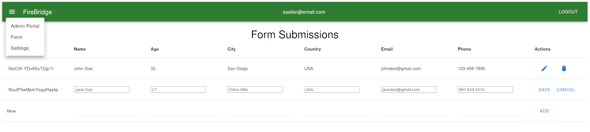

<div align="center">

  

  <h3>FireBridge</h3>

  An intuitive interface for managing data with Google Firebase.

</div>

## Overview



FireBridge provides a comprehensive solution for managing Google Firebase data. It features a user-friendly interface for executing CRUD (Create, Read, Update, Delete) operations on data presented in a tabular format, utilizing Material-UI and React for a responsive experience. The application ensures secure user authentication and leverages Google Firebase for backend data services. With the integration of Electron, FireBridge delivers functionality across a variety of desktop operating systems.

## Prerequisites

Before you begin, ensure you have met the following requirements:

- You have installed the latest version of [Node.js and npm](https://nodejs.org/).
- You have a Google Firebase account and have created a Firebase project.
- You have installed Git (optional, for cloning the repository).

## Setup and Installation

Clone the repository to your local machine and install dependencies:

```bash
git clone https://github.com/ssstier/firebridge.git
cd firebridge
npm install
```

To start the application in development mode:
```bash
npm start
```

To run the application as a desktop app with Electron:
```bash
npm run build
npm run electron
```

## Configuration

To use FireBridge with your Google Firebase, you'll need to set up your Firebase project settings. Follow these steps to configure your environment:

1. Rename the [`firebaseConfig.template.js`](./src/firebaseConfig.template.js) file in the `src` directory to `firebaseConfig.js`.
2. Go to the [Firebase Console](https://console.firebase.google.com/).
3. Select your project or create a new one if necessary.
4. Navigate to 'Project Settings' > 'General' tab.
5. Scroll to 'Your apps' and select the Firebase app you are using.
6. Click on 'Firebase SDK snippet' and then select 'Config'.
7. Copy the config object and replace the placeholder values in [`firebaseConfig.js`](./src/firebaseConfig.js) with your specific Firebase configuration.
8. Do not commit `firebaseConfig.js` to your repository. Ensure it is listed in your [`.gitignore`](./.gitignore) file to prevent exposing your private keys.

Additionally, you'll need to adjust the [`columns.js`](./src/columns.js) file:

1. Align the [`columns.js`](./src/columns.js) file in the `src` directory with your Firebase database schema.
2. Modify the columns array to match the fields in your Firebase database, ensuring each field has properties such as `id` and `label`.
3. Set up the initial submission state. Alter the `initialSubmissionState` object to include keys corresponding to the column IDs with any default values necessary for a new submission.

## Realtime Database Rules

For the realtime database rules, follow these steps to set up user authentication:

  1. In the Firebase console, go to the 'Database' section and select the 'Realtime Database' feature.
  2. Navigate to the 'Rules' tab.
  3. Here, you can define the rules that control read and write access to your database. Below is an example rule set that allows only authenticated users to read data, while write access is public:

```json
{
  "rules": {
    ".read": "auth != null && auth.uid === '<YOUR-USER-ID>'",
    ".write": "true"
  }
}
```

Replace <YOUR-USER-ID> with the actual user ID of the admin user to restrict read access. Note that .write is set to true which means that write access is public. This is probably not what you want in a production environment.

## Terms of Use

FireBridge is free and distributed under the [**MIT License**](./LICENSE). You are free to use, modify, and distribute the game according to the terms of this license.